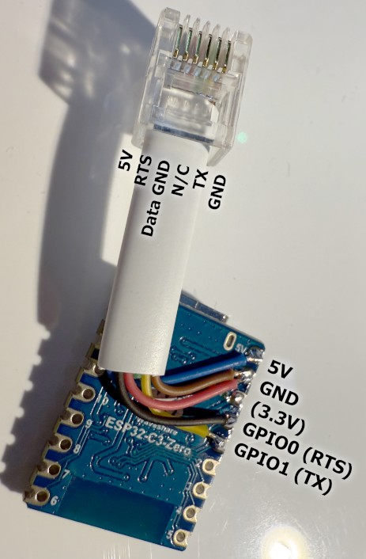
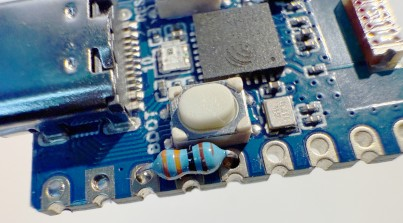
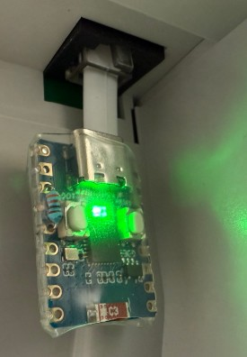

# Build instructions for (Waveshare) ESP32-C3-Zero

- 1 [(Waveshare) ESP32-C3-Zero](https://www.waveshare.com/wiki/ESP32-C3-Zero) or clone.
- 1 RJ12 connector and cable (6 wires)
- 1 Resistor in the range 1 - 4 kΩ is recommended.
- Optionally, hot melt glue and large heat shrink tubing.

Connect according to this image:

It is fairly likely that the internal pull-up resistor will not be effective at the data rates used by the serial communication.
Adding an external pull-up resistor between 3.3V and GPIO1 will avoid the risk of having to troubleshoot a likely problem:

Some hot-melt glue and heat shrink tubing will make it more robust:

