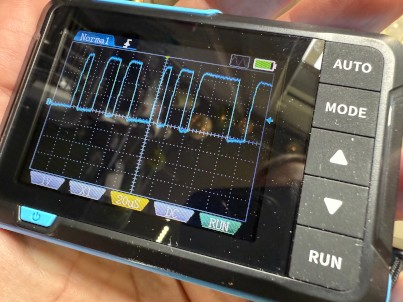
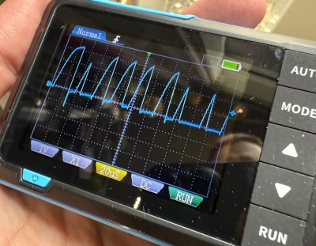

# Troubleshooting
Things to check if something is not working:

## WiFi
Make sure the p1mini is connecting to your WiFi:
* Access the web browser on the P1mini: (usually) http://p1mini.local/
* Temporarily move it closer to the router, in case it is out of range.
* etc

## Log
Check the log (and probably set the log level to DEBUG in the yaml file).

### No data received...
If you see `No data received for 60 seconds.` in the log, no data at all is beeing received.
* Verify that the port is enabled. Check with the supplier.
* Check that the correct pin is soldered in the right place.
* If you can, inspect the signal with an oscilloscope. The signal should consist of distinct pulses at around 3.3V:

### Unknown data format...
If you see `Unknown data format (0x??). Resetting.`, followed by a lot of `Discarding: ...`, then data is beeing received but it is incorrect in some way.

If you are inverting the signal in hardware (using a transistor etc) make sure that you are not also inverting in the yaml.

If the discarded data contains a lot of "weird" sequences, like `c3e3c3c3c3c3`, `f8f8ffff`, etc, it is likely that the internal pullup resistor in the ESP chip is not working properly. This seems to be the case for some chips and/or meters and I am not sure why it happens. When looking at the signal it might look like this:

In many cases, this can be fixed by adding an external resistor between 3.3V and the input pin (RX on a D1 mini) on the ESP module. Lower resistances are more "aggressive" and I would not recommend going below 500Ω but in many cases values as high as 5kΩ work fine!

